# Tarea 4: Softmax

Este código base es prácticamente idéntico al de la tarea 3, pero con
archivos base para la implementación de softmax. La idea es que usted
importe rápidamente los avances realizados en la tarea 3 acá, y que
continúe con la implementación de los métodos de optimización
faltantes (adam y rmsprop), así como la hipótesis y pérdida de
softmax.

Deberá en esta tarea trabajar en técnicas de visualización del espacio
de características, aunque en los ejemplos de las lecciones ya
encuentra bastante información al respecto.

## Dependencias

Este código utiliza los paquetes statistics y automatic-differentiation.
Desde la terminal de GNU/Octave los instala con:

     pkg install -forge statistics
     pkg install "https://github.com/StevenWaldrip/Automatic-Differentiation/archive/refs/tags/1.0.0.tar.gz"

## Ejecución de la solución

- Ubiquese en la carpeta `root` del repositorio.

### Softmax

- Ejecute el siguiente código en la terminal de GNU/Octave:

```octave
    octave softmax_main.m
```

- Corresponde a la solución de la parte 1,2,3,4,5,6,7,8,9,10 de la tarea.

Nota: Al principio del código se encuentran flags para ejecutar partes
especificas de la tarea por defecto se ejecutan todas las partes. Si
desea ejecutar solo una parte, ponga la flag en `false`.

| Flag              | Descripción                                     |
| ----------------- | ----------------------------------------------- |
| `part_4_5`        | Corresponde a la solución 4_5 de la tarea.      |
| `part_6_7_8_9_10` | Corresponde a la solución 7,8,9,10 de la tarea. |

## Documentación de la Solución

También se generó un `solution.pdf` de este mismo readme. Se ubica en la
carpeta `docs` junto con todas las gráficas de la tarea.

### Parte 1 y 2

- Se agrega la hipótesis de softmax.

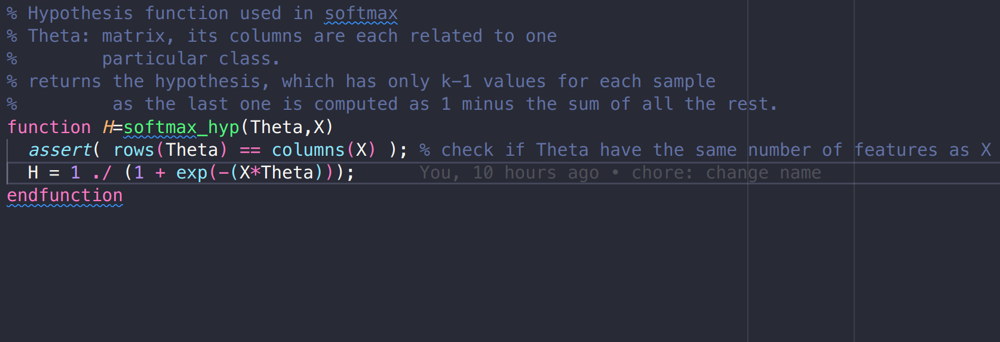

- Se agrega la perdida de la softmax.

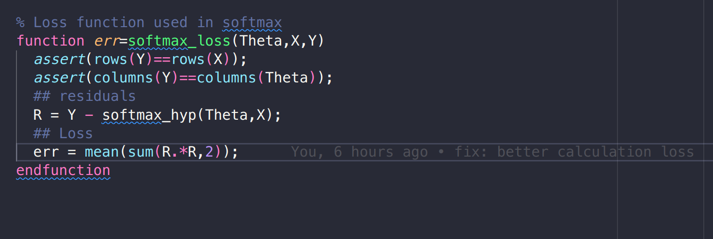

### Parte 3, 4, 5

- Se optimiza softmax con los metodos de
  `"sgd"`, `"momentum"`, `"rmsprop"`, `"adam"` y `"batch"`,.
  Y se gráfica el error de la perdida.

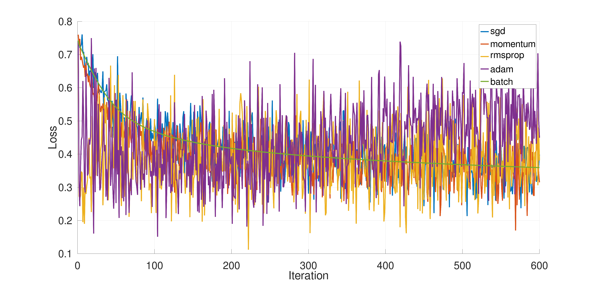

- Se calcula el error empírico de softmax.

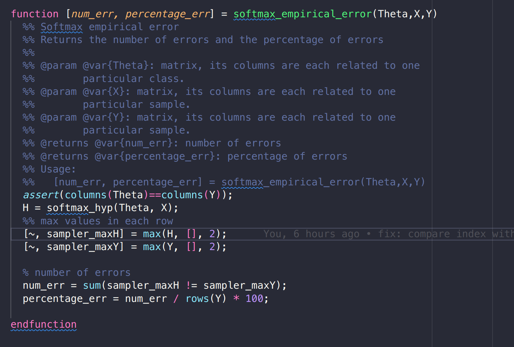

- Se obtiene el resultado del error emprico de softmax,
  para cada de los métodos de optimización.

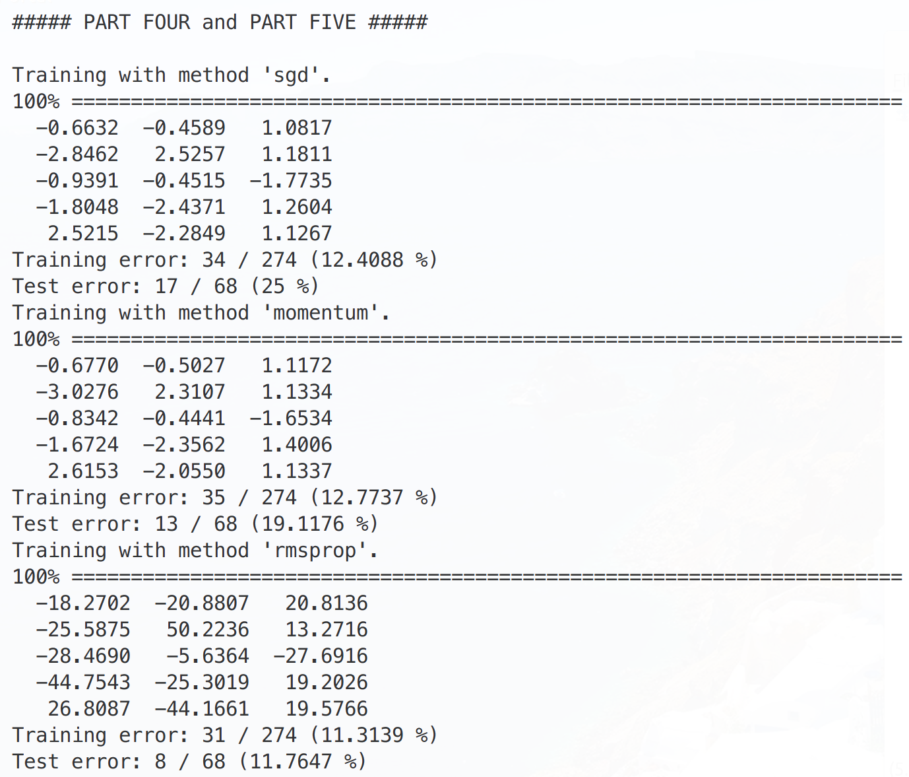

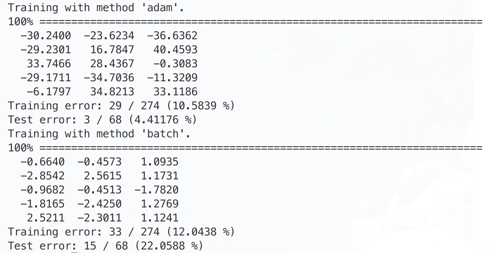

- Se observa que el de menor error empírico fue el `"rmsprop"` y el `"adam"`.

### Parte 6, 7, 8, 9

- Para encontrar de forma empírica la features más relevantes para
  softmax para conocer la especie de los pingüinos, se
  calcula el error empírico para dos pares de features. Utilizamos
  el método `"adam"` para softmax, para la minización
  del error.

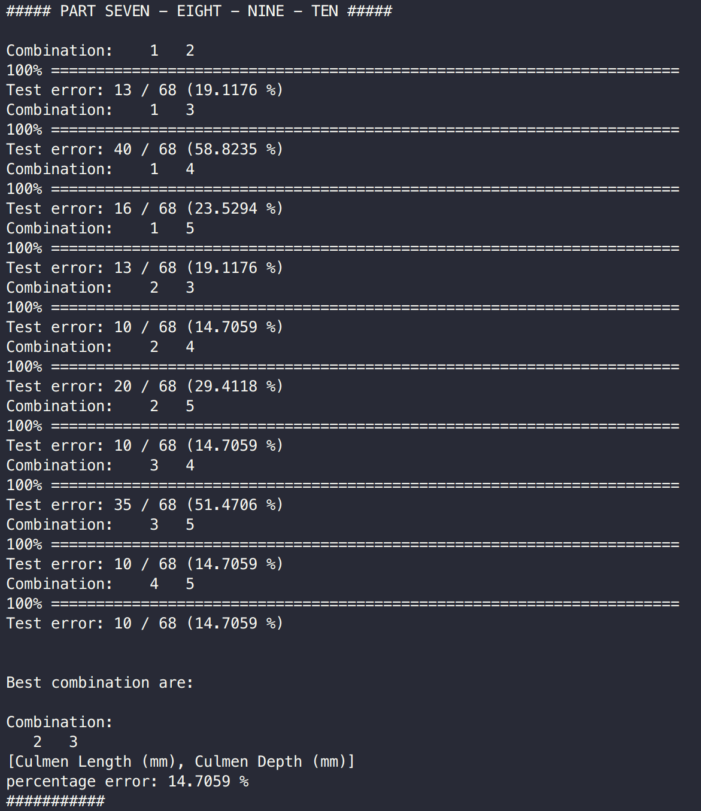

- Obtuvo que $\theta_3$ "Culmen Depth (mm)" y $\theta_4$ "Culmen Length (mm)"
  son las features más relevantes.

- Se dibuja la superficie generada por softmax de las
  features "Culmen Depth (mm)" y "Culmen Length (mm)".

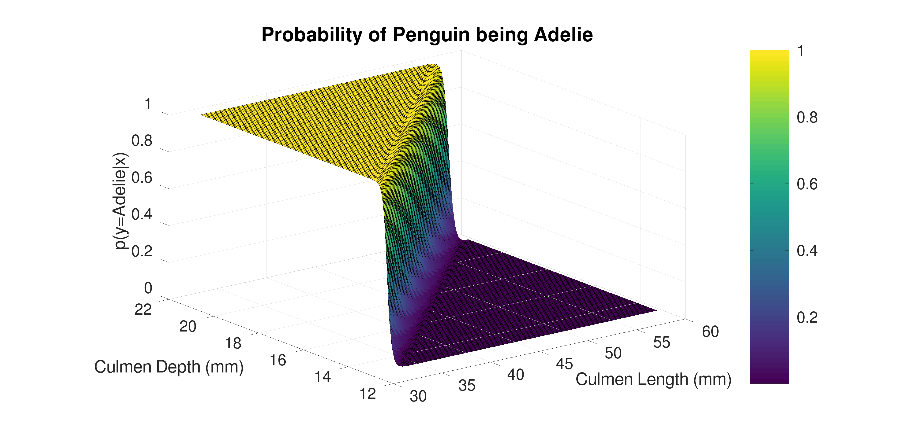

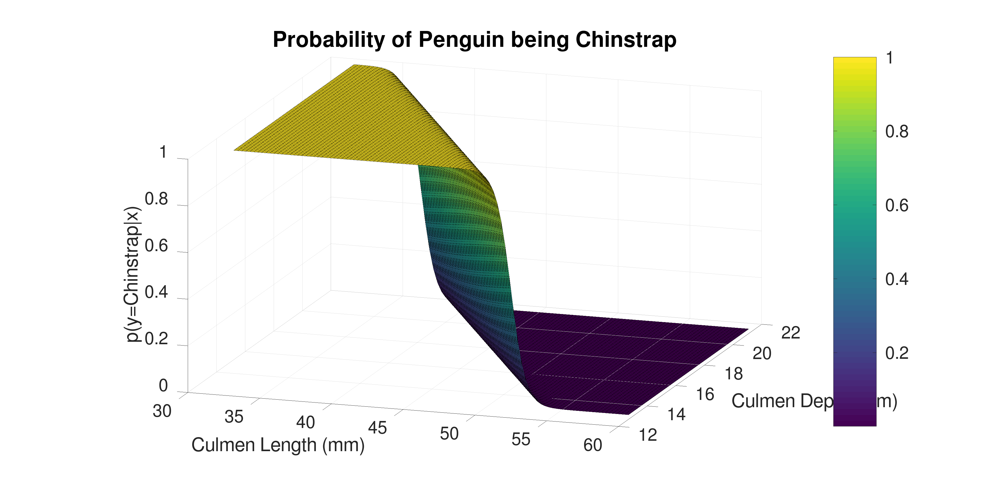

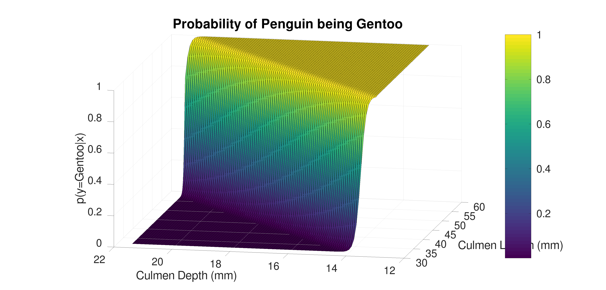

- Se gráfica la probabilidad del ganador de decisión de las features "Culmen Depth
  (mm)" y "Culmen Length (mm)".

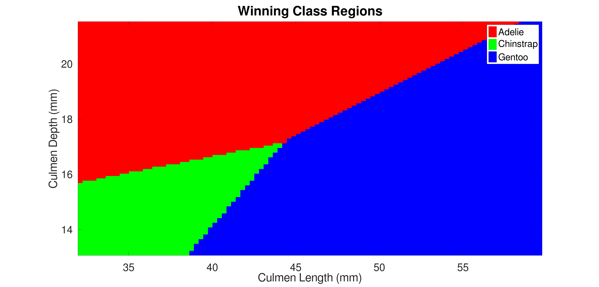

- Se gráfica la probabilidad del ganador con pesos de decisión de las features
  "Culmen Depth (mm)" y "Culmen Length (mm)".

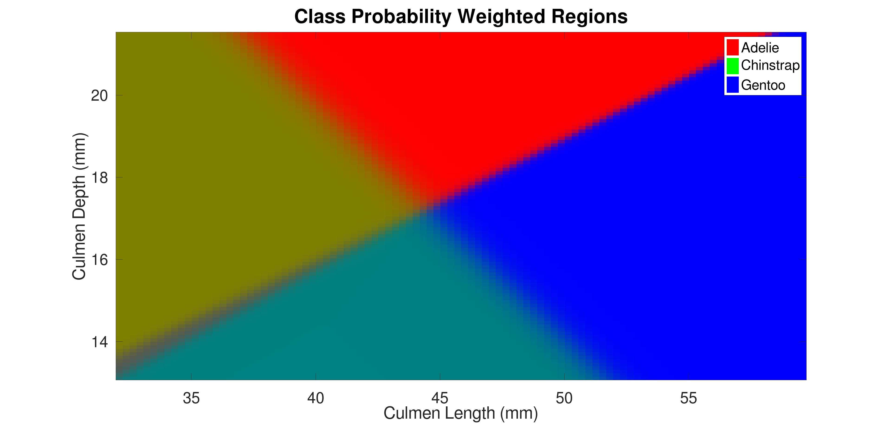

### Parte 10

- Se dibuja la superficie generada por softmax de las
  features "Culmen Depth (mm)" y "Culmen Length (mm)".

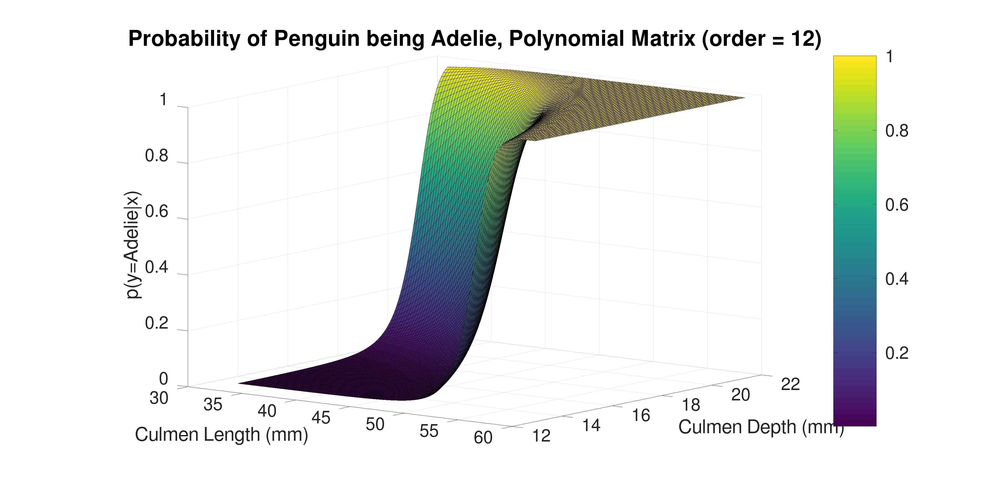

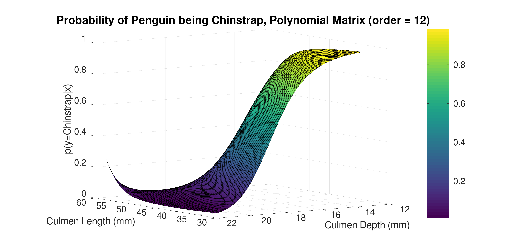

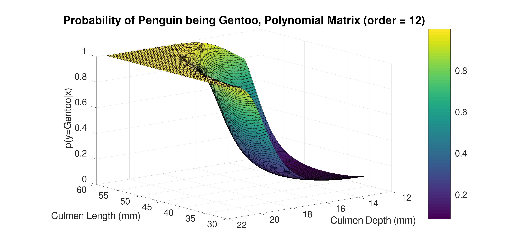

- Se gráfica la probabilidad del ganador de decisión de las features "Culmen Depth
  (mm)" y "Culmen Length (mm)".

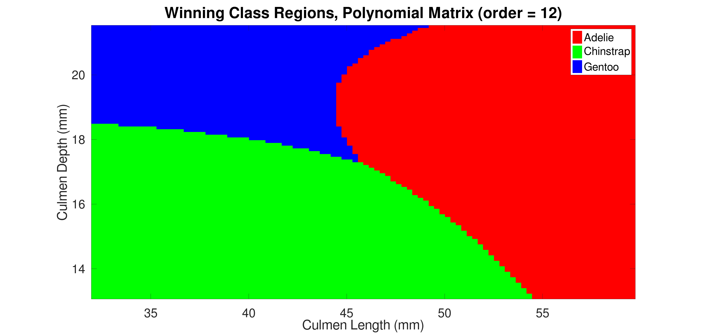

- Se gráfica la probabilidad del ganador con pesos de decisión de las features
  "Culmen Depth (mm)" y "Culmen Length (mm)".

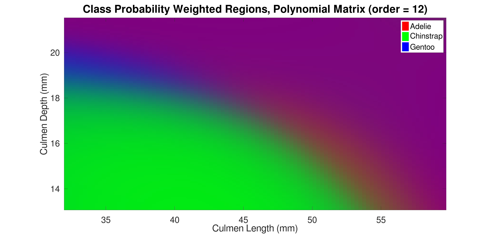

## Integrantes

- Carlos Andrés Mata Calderón - 2019033834
